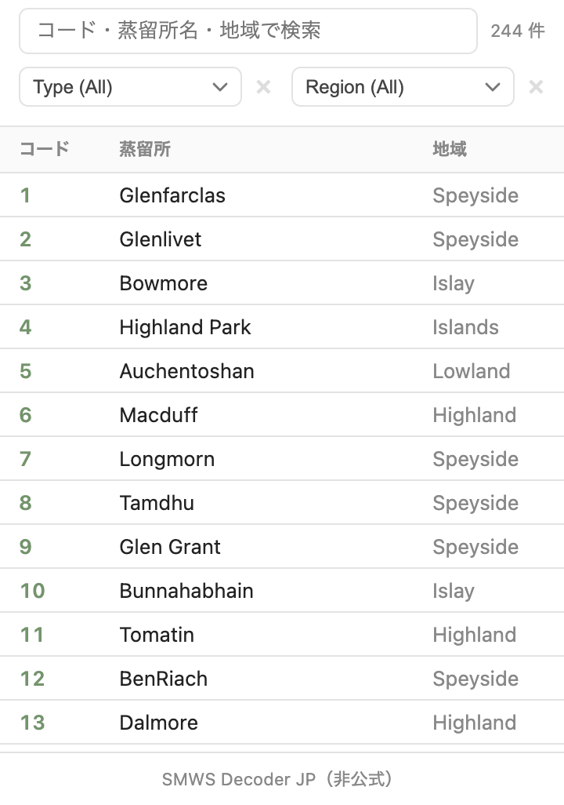
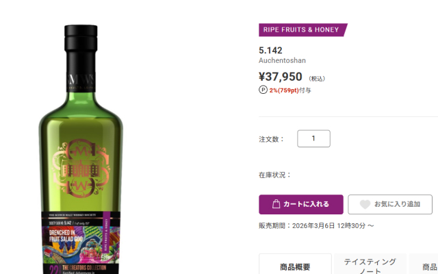

# SMWS Decoder JP

SMWS JPのサイト上で蒸留所名を表示するための非公式拡張機能です。  
ご意見・不具合報告は SMWS Japan様ではなく開発者（X: @dzgm）までお願いします。

---

## 機能

- 商品一覧・商品詳細・お気に入り・マイページ・注文詳細のコードに蒸留所名を表示
- 蒸留所コードの絞り込みでの蒸留所名表示、およびクリアボタンの追加
- 拡張機能アイコンから蒸留所コード一覧を表示（コード・蒸留所名・地域で検索など）

## スクリーンショット

### 蒸留所コード一覧



### 商品一覧


### 商品詳細



## インストール

### Chrome Web Store（推奨）

[Chrome Web Store の配布ページ](https://chromewebstore.google.com/detail/smws-decoder-jp/ibglgjkokeogkjnkcnlofgmncicmfkbh) からインストールできます。

### 手動インストール

1. [Releases](../../releases) から最新の `smws-extension.zip` をダウンロード
2. Chrome で `chrome://extensions` を開く
3. 「デベロッパーモード」を有効にする
4. 「パッケージ化されていない拡張機能を読み込む」から解凍したフォルダを選択

### ソースからビルド

```bash
git clone https://github.com/azmdz/SMWS-code-display.git
cd SMWS-code-display
yarn install --ignore-engines
yarn zip   # dist/smws-extension.zip が生成される
```

## 開発

```bash
yarn dev
```

初回は Chrome の拡張機能管理画面で `dist/` フォルダを Unpacked extension として読み込んでください。  
以降はファイルを保存するたびに自動でリロードされます。

## テスト

```bash
yarn test                        # ビルド → Playwright テスト実行
SMWS_ORDER_ID=xxxxxxx yarn test  # 注文詳細テストを含める場合
yarn test:reset-auth             # ログイン情報をリセット
```

初回実行時はブラウザが開くのでログインしてください。以降はログイン状態が保持されます。

## リリース

```bash
yarn version --patch   # 例: 1.0.0 → 1.0.1
git add -A && git commit -m "release v1.0.1"
git tag v1.0.1
git push origin main --tags
```

タグをプッシュすると GitHub Actions が自動でビルド・zip 生成・リリース作成を行います。

## 対応ページ

| ページ     | URL                               |
| ---------- | --------------------------------- |
| トップ     | `/`                               |
| 商品一覧   | `/product/list`                   |
| 商品詳細   | `/*/product/*`                    |
| お気に入り | `/account/favorite/list`          |
| マイページ | `/account/top`                    |
| 注文詳細   | `/account/order-history/detail/*` |
